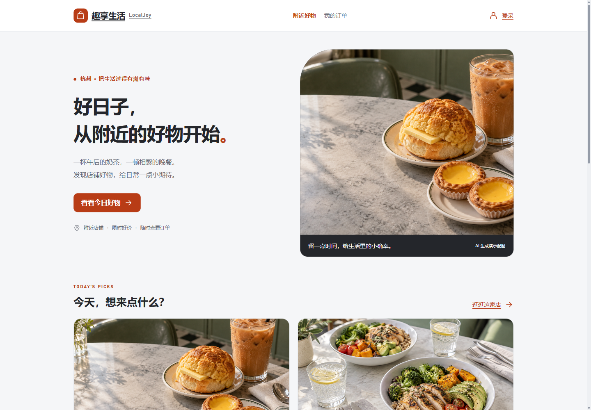

# LocalJoy · 趣享生活

面向本地生活场景的 Java + React 学习项目。以 **店铺商品 → 秒杀受理 → 异步建单 → 本地模拟 / 支付宝沙箱支付 → 超时关闭** 为主线，展示 Redis 库存预扣、RocketMQ 异步处理、幂等补偿、商品缓存与滑动窗口限流。

主站已改为 **React**，围绕商品与订单组织页面；原版 Vue 页面保留为存档。默认可本地模拟支付；配置后支持支付宝官方沙箱二维码、RSA2 验签通知与服务端查单，**不会扣真实资金**。配置步骤及密钥区别见[支付宝沙箱接入指南](docs/alipay-sandbox.md)。



## 能做什么

| 页面 / 能力 | 当前实现 |
| --- | --- |
| 附近好物 | 真实店铺查询、名称搜索、分页、演示商品展示 |
| 店铺与商品详情 | 店铺商品列表、详情缓存、活动起止与库存展示、缺图回退 |
| 商品秒杀 | Lua 原子校验活动、库存与购买资格，记录预占订单归属，再发送 MQ |
| 我的订单 | 当前登录用户的订单分页、精确字符串订单号、异步建单结果查询 |
| 模拟支付与关单 | 截止时间 + 状态 / version 条件更新；重复确认与库存回补保护 |
| 支付宝沙箱 | 下单金额快照、唯一支付流水、RSA2 验签、查单恢复、渠道关单确认后回补库存 |
| 商品缓存 | 空值缓存、互斥重建；Canal → MQ → 删除缓存，失败消费重试 |
| 多维限流 | Redis ZSet + Lua + AOP，支持全局 / IP / 用户维度 |

新消费者组从最早可用消息开始，避免启动时跳过首笔建单或关单消息；已有消费位点仍按原进度继续。实现原理和故障边界见[商品秒杀与缓存一致性详解](docs/商品秒杀与缓存一致性详解.md)。

## 技术栈

- 后端：Java 8、Spring Boot 2.3.12、MyBatis-Plus、Flyway。
- 中间件：MySQL 5.7、Redis 6.2、Redisson、RocketMQ、Canal。
- 前端：React 19、React Router 7、Vite 8、原生 CSS；精确依赖版本写入 lockfile。
- 验证：JUnit 集成测试、Node 内置测试、浏览器实际流程检查、GitHub Actions 构建。

## 本地运行

需要 JDK 8、Maven、Node.js **22.12+**、Docker Desktop。所有命令从仓库根目录执行，除非示例明确切换目录。

### 1. 中间件

**全新环境**可使用独立 MQ 覆盖文件：

```powershell
Copy-Item .env.example .env
docker compose -f docker-compose.yml -f docker-compose.local.yml up -d
docker compose -f docker-compose.yml -f docker-compose.local.yml ps
```

该配置包含 MySQL、Redis、RocketMQ NameServer / Broker、Canal，不需要另一个项目的容器。Broker 默认通告 `host.docker.internal`；它必须能被宿主机 Java 和 Canal 同时访问。其他系统或网络需修改 `.env` 中的 `ROCKETMQ_BROKER_IP`，详见[启动与演示指南](docs/local-setup.md)。

**复用本机已有 StudyAgent RocketMQ** 时，沿用原配置：

```powershell
docker start study-agent-rocketmq-namesrv study-agent-rocketmq-broker
docker compose up -d mysql redis canal
```

两种方案二选一，不能在相同端口上启动两套 MQ。本轮运行验收使用第二种已有环境；独立覆盖配置通过 Compose 配置校验，尚未在空机器上完整验收。

### 2. 后端

确认 `JAVA_HOME` 指向 JDK 8：

```powershell
mvn -DskipTests package
java -Duser.timezone=Asia/Shanghai -jar target/hm-dianping-0.0.1-SNAPSHOT.jar
```

后端默认 `http://127.0.0.1:8081`，绑定本机。配置在 [application.yaml](src/main/resources/application.yaml)。首次空 MySQL 数据卷导入课程 SQL，后续表结构由 Flyway 迁移，**重启不会重新导入已有数据库**。

### 3. React 前端

新终端执行：

```powershell
cd frontend
npm ci
npm run dev
```

打开 [http://127.0.0.1:8088](http://127.0.0.1:8088)。Vite 将 `/api` 代理到后端，不需要自己配置 CORS。可通过 `PORT` 和 `BACKEND_URL` 环境变量覆盖默认值。

### 4. 准备商品并登录

后端启动后，在仓库根目录执行：

```powershell
.\scripts\seed-demo.ps1
```

脚本创建两款限时演示商品；已有未结束的同名演示商品会复用，**不会重置库存、订单或用户购买资格**。首页自动读取商品，不使用前端假数据。

在页面输入本地测试手机号并点击“获取验证码”。本项目没有短信渠道，验证码保存在本机 Redis：

```powershell
# 将占位符替换为页面中填写的手机号
docker exec hmdp-redis redis-cli GET login:code:<测试手机号>
```

验证码不能提交到仓库。输入验证码登录后会返回原页面；再次点击“立即抢购”，进入等待建单与订单详情，随后可“模拟支付（不扣款）”。

## 页面与 API

| React 路由 | 主要 API |
| --- | --- |
| `/` | `GET /shop/of/name`、`GET /product/list/1` |
| `/shops/:id` | `GET /shop/{id}`、`GET /product/list/{shopId}` |
| `/products/:id` | `GET /product/{id}`、`POST /product-order/seckill/{id}` |
| `/orders` | `GET /product-order/list?current=1`，每页 10 笔，仅当前用户 |
| `/orders/:id` | `GET /product-order/{id}`、`POST /product-order/pay/{id}` |
| `/login` | `POST /user/code`、`POST /user/login` |
| `/legacy/index.html` | 原版 Vue 页面存档，不属于主站验收范围 |

秒杀返回订单号代表请求已受理，不代表数据库已建单。订单页有有界轮询、手动刷新、网络失败提示；支付状态以服务端为准。订单 ID 以字符串传递，避免 JavaScript 大整数精度丢失。

## 检查与构建

```powershell
cd frontend
npm test
npm run check
npm run build
npm run preview
```

`npm run preview` 默认使用 8088，与开发服务二选一。生产构建位于 `frontend/dist`。也可在构建后从仓库根目录运行 `node frontend/server.mjs`，用本地静态服务器同时提供 SPA 回退与 API 代理。

后端集成测试需专用数据库和 Redis DB 14：

```powershell
.\scripts\test-resume.ps1 -JavaHome '你的 JDK 8 目录'
# 可选：真实 MQ / 服务层测量
.\scripts\test-resume.ps1 -JavaHome '你的 JDK 8 目录' -RealMq -Benchmark
.\scripts\test-product-canal.ps1
```

详细结果和验证口径见[前端验收记录](docs/frontend-acceptance.md)、[简历实现证据](docs/resume-evidence.md)。CI 执行前端测试、检查和构建，以及 Java 打包；CI 的 Java 打包不代表中间件集成测试已运行。

## 项目结构

```text
frontend/
  src/                     React 页面、共享组件、请求与领域工具
  public/imgs/             原版素材与生成的演示商品图
  public/legacy/           原版 Vue 页面存档
  scripts/check.mjs        交互约定与设计 token 检查
  vite.config.js           开发和预览 API 代理
  server.mjs               构建产物的本地静态服务
src/main/java/com/hmdp/
  controller/              HTTP API
  service/impl/            商品、订单与原有业务
  mq/                      建单、关单消费者
  canal/                   数据库变更与缓存处理
src/main/resources/
  db/migration/            Flyway 迁移
  product_*.lua            秒杀预占与幂等回补
docker/                    MySQL、Canal、可选独立 RocketMQ
scripts/                   演示数据与集成测试入口
docs/                      机制说明、测量原始数据、截图与验收
```

## 文档索引

- [支付、超时关单与并发冲突验证](docs/payment-verification-2026-09-16.md)：简历 bullet 对应场景、实际并发、CAS 冲突、补偿失败恢复及真实 MQ 证据。

- [启动与演示指南](docs/local-setup.md)：环境、端口、验证码、故障定位。
- [前端验收记录](docs/frontend-acceptance.md)：React 流程与浏览器检查。
- [商品秒杀与缓存一致性详解](docs/商品秒杀与缓存一致性详解.md)：重复补偿、迟到消息、支付竞争、Canal 缓存失效。
- [简历表述与实现证据](docs/resume-evidence.md)：代码、测试和性能数字的边界。
- [前端开发说明](frontend/README.md)、[设计约定](DESIGN.md)、[交互约定](UX-CONTRACT.md)。
- [原有架构图](docs/diagrams/hmdp-project.architecture.html)、[商品秒杀流程图](docs/diagrams/product-seckill.workflow.html)。

## 边界与素材来源

这是学习与面试演示项目，不是可直接公网运营的交易系统。课程遗留的商品、店铺写入与上传等接口没有完整管理员权限体系。支付宝仅接沙箱，新增订单有价格快照，历史订单不补造金额。尚无生产支付、退款与核销；渠道结果长期不明可能保留库存，终态冲突需要人工核账，详见[支付边界](docs/alipay-sandbox.md#4-支付与关单如何竞争)。

Redis 预占后、MQ 发送前进程崩溃的孤立预占仍需补充对账恢复；缓存是最终一致性，永久故障与死信消息需要人工处置。未证实 TPS 2000 或查询延迟降低 30%，不将它们作为项目已达成指标。

原版前端恢复自本机 hmdp 目录，其 Git remote 指向 [huyi612/hmdp-web](https://gitee.com/huyi612/hmdp-web)。第三方库和课程图片保留原声明，本仓库不替上游素材新增授权。新增下午茶与轻食图片为 AI 生成演示素材，页面有标注；不代表真实商家实拍。
