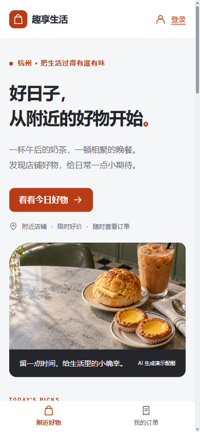
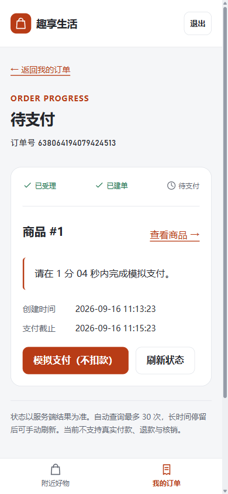

# React 前端改造与验收

验收日期：2026-09-16。主站从恢复版 Vue 页面迁移为 React 19 + React Router 7 + Vite 8，保留原来的 Java API。原版 Vue 页面位于 `frontend/public/legacy`，仅作来源存档。

## 改造范围

围绕简历中的业务主线组织页面：附近店铺与商品 → 商品活动 → 秒杀受理 → 我的订单 → 模拟支付 / 超时关闭。没有继续建设笔记、签到、关注和聊天页面，也没有把 Redis、MQ 等内部实现细节塞进购买流程。

后端新增当前用户订单分页查询；订单号在 HTTP JSON 中统一使用字符串，避免 64 位 ID 被浏览器截断。商品图片为两张 AI 生成的本地演示素材，页面注明来源；接口数据来自真实后端。

## 本轮实际验证

环境：Windows、JDK 8、MySQL 5.7、Redis 6.2、已有 RocketMQ 5.3.2 与 Canal 容器；前端 Vite 8088、后端 8081，另在 8089 检查构建产物服务。

| 检查 | 结果与范围 |
| --- | --- |
| 登录 | 未登录抢购跳转登录；空字段错误可见；真实申请 Redis 验证码、登录后回原商品；退出请求成功，后续订单需重新登录 |
| 商品查询 | 首页、店铺、商品详情读取真实 API；下午茶与轻食配图正常加载 |
| 下单与模拟支付 | 演示轻食订单经真实 MQ 落库，页面从受理转为待支付；点击模拟支付后成为已支付，不发生真实扣款 |
| 超时关闭 | 临时将超时设为 120 秒、延迟级别设为 3。下午茶订单被延迟消息关闭，status=4、version=1；DB / Redis 库存均恢复为 30，购买预占删除 |
| 已支付保护 | 轻食订单保持 status=2、version=1，DB / Redis 库存均为 19，后续延迟消息没有关闭它 |
| 订单列表 | 当前用户列表同时显示上述已支付与已关闭订单；跨用户隔离和 10 条分页由真实 DB 集成测试验证 |
| 网络故障 | 浏览器切换离线后刷新，出现网络错误及重新加载按钮；恢复网络后显示服务端最终状态 |
| 手机布局 | 390 × 844 下检查订单与首页；订单截图无横向溢出（内容宽度 380px），底部导航可见 |
| 桌面布局 | 1440 × 1000 首页截图检查；商品图片、主导航和两列内容正常 |
| 构建服务 | Node 静态服务器上的 `/`、商品/订单深链接、旧入口兼容、原版存档均 HTTP 200；`/api/product/1` 返回真实 JSON |

前端 5 个 Node 测试通过，覆盖同源登录跳转、字符串 ID、活动时间边界、金额/图片/分页回退、401/429/网络/业务错误区分。`npm run check`、`npm run build` 通过。UI strict audit 为 0 errors / warnings；DESIGN.md lint 为 0 errors、8 个未在组件配置引用 token 的提示，运行时 CSS token 同步另由 check 校验。浏览器离线检查产生预期网络错误，恢复在线后没有观察到新的应用脚本异常；这不等于覆盖了所有浏览器与辅助技术。

常规后端回归：18 个已发现用例，15 个通过、0 失败/错误、3 个显式开关用例跳过。[原始清单](evidence/2026-09-16-functional-tests.json)。真实 MQ 首次消费回归另行通过：[结果](evidence/2026-09-16-first-message-evidence.json)。未重新进行容量或缓存性能测量，历史测量见[简历证据](resume-evidence.md)。

## 首笔 MQ 消息的修复

联调发现：业务 Topic 首次出现时，默认从末尾建立消费位点，可能跳过已经发送的首条消息。商品建单和商品关单消费者已明确配置 `CONSUME_FROM_FIRST_OFFSET`，仅影响没有保存位点的新组；已有进度不自动回退。

回归测试先发布消息，再启动两个独立新消费组，并调用两个实际消费者类的生命周期配置，两组均收到消息。历史遗漏不是靠修改配置自动恢复：本次只核对并重发一条属于演示用户的旧消息，随后确认落库和超时回补。曾尝试精确位点恢复但没有观察到重投，因此不把该操作记为恢复成功，也不提供全量重置消费位点的通用命令。

## 复现入口与边界

- 按[本地启动指南](local-setup.md)运行并执行 `scripts/seed-demo.ps1`；该脚本不重置已有库存。
- 功能测试：`scripts/test-resume.ps1`；首次消息回归可单独运行 `mvn "-Dtest=ResumeEvidenceTest#freshConsumerGroupsReceiveMessagesPublishedBeforeStartup" "-Dresume.realMq=true" test`。
- 默认业务超时仍为 30 分钟；120 秒是本轮运行参数，不写入应用默认配置。
- 独立 RocketMQ Compose 覆盖文件通过配置校验，尚未在空环境完整验收。
- 真实支付、退款、核销、订单价格快照、原版社交业务不在本轮实现范围。CI 的 Java 打包不能替代本地中间件集成测试。

